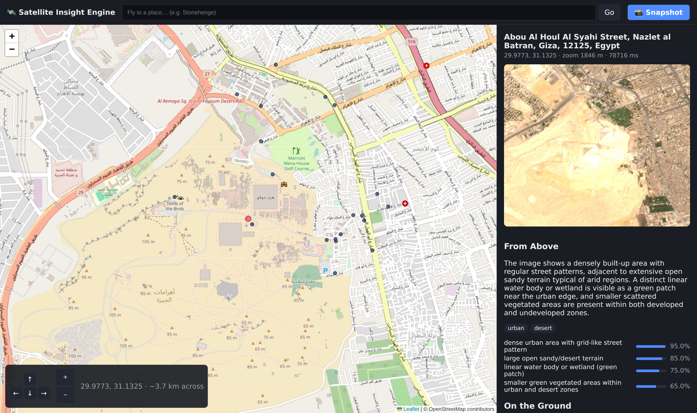

# Satellite Insight Engine

Type a place name, get a satellite image of it, and receive a rich, **sourced** report:
a structured + narrative reading of the image from a local vision model, corroborated with
live facts from Wikipedia, OpenStreetMap, weather/elevation APIs, and the web. Navigate the
surrounding area with WASD/zoom.



*The browser GUI: pan/zoom to frame a view, press Snapshot, and read the result in the side
panel — imagery provenance badge, weather bar, the AI reading with confidence, plus news,
history, POIs and sources. The layout is responsive (mobile bottom-sheet).*

```
Enter a location to analyze: Eiffel Tower
Location: Avenue Gustave Eiffel, Paris, France
Coordinates: (48.8584, 2.2945)  Zoom: 2500m

AI analysis:
A dense urban scene bisected by a river, with a prominent open green corridor...
Features: dense urban area (High), river (Medium)

Context:
The Eiffel Tower was constructed in 1887–1889 for the International Exposition...

Rich view: open output_images/2026-06-25/122519/run.html in your browser
```

## How it works

```
place name ──► geocode ──► Earth Engine imagery ──► vision model ──► enrichment ──► report
                (Nominatim)   (tiered: Sentinel-2    (minicpm-v4.5)   (lfm2.5 + tools)  (JSON + report.md)
                              → Landsat → NASA GIBS)
```

Everything runs through a UI-agnostic engine (`satviz/engine.py`) that returns a `Report`
object. The CLI and the browser GUI are both thin presenters over the same seam — the GUI
was layered on without touching the core.

## Requirements

- **Python 3.12** with a virtual environment.
- **[Ollama](https://ollama.com)** running locally, with the models pulled:
  ```bash
  ollama pull minicpm-v4.5:q8_0   # vision
  ollama pull lfm2.5              # enrichment agent
  ```
- **Google Earth Engine** access: a Google account, a GEE Cloud project, and a one-time
  `earthengine authenticate`.
- *(Optional)* an **`OLLAMA_API_KEY`** for hosted web search. Without it, enrichment falls
  back to free, no-key sources (Wikipedia, OpenStreetMap, Open-Meteo).

## Setup

```bash
python -m venv .venv
source .venv/bin/activate
pip install -r requirements.txt

earthengine authenticate          # one-time Google Earth Engine login

cp .env.example .env              # then edit .env with your GEE project id
```

`.env` keys:

| Key | Purpose |
|-----|---------|
| `GEE_PROJECT` | Your Google Earth Engine Cloud project id (required) |
| `NOMINATIM_AGENT` | User-agent string for OpenStreetMap requests |
| `OLLAMA_API_KEY` | Optional; enables hosted web search |
| `VISION_MODEL` / `AGENT_MODEL` | Ollama model names |
| `RETENTION_DAYS` | Days to keep saved runs before auto-purge (default 30) |
| `DEFAULT_BUFFER` | Initial zoom radius in metres |

`OLLAMA_API_KEY` may also be supplied via your shell environment instead of `.env`.

## Usage

```bash
source .venv/bin/activate

python main.py                       # interactive CLI (default)
python main.py --gui                 # browser GUI on http://localhost:8000
python main.py --gui --port 9000     # custom port
```

**CLI** controls during a session: `W/A/S/D` move, `Z/X` zoom in/out, `Q` quit.

**Browser GUI** (FastAPI + Leaflet + HTMX): pan/zoom the map freely (instant), then press
**📸 Snapshot** to analyse the framed view. The capture area is derived from what's visible —
zoom in for a sharper, narrower view; zoom out for wider regional context.

*Navigation & capture*

- Arrows / `W A S D` pan, native + pinch zoom, `Enter` snapshots; the **⌨ help** button lists shortcuts.
- **🎲 Surprise me** jumps to a random world-famous landmark; **🌍 Anywhere** drops on a random point on land.
- An open-water warning appears before remote captures, and the map restores your **last position**.

*Live analysis*

- The snapshot runs as a background job with a **live per-stage progress** panel
  (imagery → vision → enrichment → report) and a **✕ Cancel** button.
- Imagery is **tiered and always-returns**: Sentinel-2 (10 m) up close, NASA GIBS MODIS for wide
  regional views, and a report even where no imagery exists.

*The report panel*

- An imagery **provenance badge** (satellite tier + resolution, relative age, a *stale* warning past 90 days).
- A **weather bar**, the AI reading, nearby POIs (click to fly in, then **Reset view**), recent
  **news**, **history**, active **natural events**, and clickable sources.
- The captured image can be shown as a **map overlay** at its true bounds or opened **fullscreen**
  by clicking it; POIs appear as **category-coded pins**.
- **🔗 Copy link** shares a saved run.

*History*

- **🕘 History** (top bar) opens past runs in a new tab — a **searchable, paginated** gallery with
  **imagery-tier filters** and a **map of every run** (click a pin to open it), served from a
  lightweight SQLite index.

You can also start the GUI directly with uvicorn:

```bash
uvicorn satviz.web.app:app --reload
```

## Output & retention

Each session writes to a date/time folder:

```
output_images/
  2026-06-25/            # day
    122519/              # session start time (HHMMSS)
      48.8584-2.2945-2500m.jpg     # satellite image
      48.8584-2.2945-2500m.json    # full structured Report
      48.8584-2.2945-2500m.report.md  # readable report
      run.html           # open in a browser for a rich image + report view
```

Runs older than `RETENTION_DAYS` (default 30) are purged automatically at startup, so disk
usage stays bounded.

## Testing

```bash
source .venv/bin/activate
python -m pytest
```

Tests cover the pure/boundary modules (navigation math, storage layout + purge, report
rendering, enrichment backend policy) plus the application layer: the result cache, run index
(search/pagination/reconcile), background-job lifecycle + cancellation, and presentation
filters. Network and model calls are not exercised in the suite.

## Project layout

```
satviz/
  config.py        # .env-driven configuration (no identifiers in source)
  models.py        # Location, ImageResult, VisionInsight, Enrichment, Report
  geocode.py       # Nominatim forward + reverse geocoding
  imagery.py       # Google Earth Engine compositing & export
  vision.py        # minicpm-v4.5 structured + narrative image reading
  enrichment/      # lfm2.5 agent + Wikipedia / OSM / Open-Meteo / web tools
  report.py        # merge + Markdown rendering
  storage.py       # dated folders, report writing, rolling purge
  navigation.py    # WASD/zoom math
  engine.py        # UI-agnostic orchestration seam (returns Report; emits progress stages)
  application/     # browser-facing service: DTOs, cache, background jobs, run index, error handling
  web/             # FastAPI app: routes, Jinja templates, Leaflet + HTMX assets
  presenters/cli.py  # terminal frontend
main.py
```

The browser layer is strictly separated: `web/` (FastAPI/HTMX/Leaflet) talks only to
`application/` (the `AnalysisService`), which talks to `engine.py`. No web concerns leak
into the engine, and the browser addresses runs by `run_id` rather than file paths.

## License

MIT — see [LICENSE](LICENSE).
